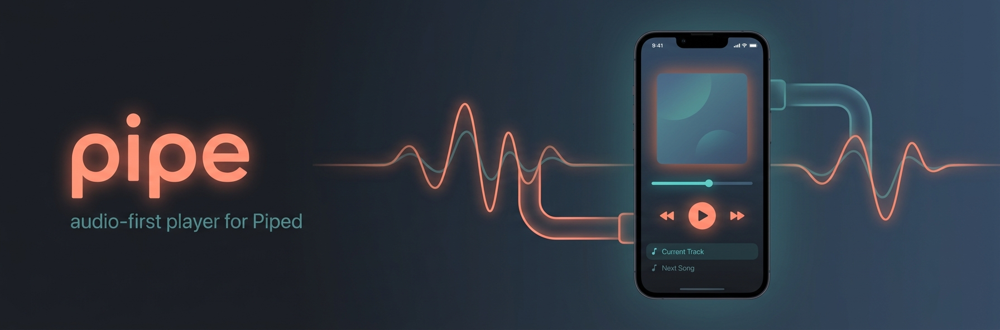

# pipe

A native **iOS audio/video player for [Piped](https://github.com/TeamPiped/Piped)**
(a privacy-friendly YouTube frontend). pipe is **audio-first**: it treats YouTube
like a podcast/music library — background audio, a mini player, a queue, followed
channels, a chronological feed, and watch history — while still handling full
video and Picture-in-Picture when you want it.

No account. No ads. No tracking by default.

## 📲 Download the beta

**TestFlight:** https://testflight.apple.com/join/Z8HcBR1K

Requires iOS 26 or later.

## Features

### Playback
- **Background audio** — keeps playing when the app is backgrounded or the screen locks.
- **Mini player + full player** — a persistent mini bar with a tap-to-expand full-screen player (artwork, scrubber, speed, chapters, info, comments).
- **Queue** — add to queue, play next, reorder, and remove; the queue is persisted across launches.
- **Lock screen & Control Center** — play/pause, skip ±10s, next/previous track, and scrubbing via the system now-playing controls.
- **Playback speed** — remembered across items (podcast-style).
- **Audio / video toggle** — play the audio-only stream to save data, or switch to full video.
- **Picture-in-Picture** — floats into PiP automatically when you background a playing video.
- **Resume where you left off** — playback position is remembered per video.
- **SponsorBlock** — auto-skips sponsor/self-promo/intro/outro segments (toggle in the player); on by default.
- **Chapters** — jump between chapters; the now-playing label tracks the current chapter.
- **Sleep timer** — sleep after N minutes, or "stop at end of episode".

### Discovery & library
- **Search** with search-as-you-type suggestions and search history.
- **Trending** and a chronological **feed** of your followed channels (with sort + "hide watched").
- **Followed channels** and channel browsing (videos, subscriber counts).
- **Playlists** — browse, play all, and save.
- **Comments** rendered as rich text; video descriptions rendered as HTML.
- **Watch history (Recents)** and **Save for later**.
- **Downloads & Offline Mode** — download for offline playback and hide network-dependent tabs.

## How it works

pipe is a **SwiftUI** app (iOS 26+, Swift 5) that talks directly to a Piped API
instance over HTTPS. There's no backend of our own for content — the app is a
thin, native client over Piped.

- **Playback** is built on **AVFoundation (`AVPlayer`)**. A `PlayerState` store
  owns playback + the queue; audio-session, now-playing, SponsorBlock, chapters,
  and stall/end-of-item recovery are layered on as focused extensions.
- **Networking** goes through a single `PipedAPI` layer (pure URL builders +
  decoding), so it's fully unit-testable.
- **Architecture:** views only render; logic lives in pure `*Logic` helpers and
  `ObservableObject` stores with injected dependencies. Every feature ships as a
  thin vertical slice with a Gherkin acceptance scenario (`.feature` files run by
  a native Swift runner) plus colocated unit tests.

### Default Piped server

By default pipe talks to **`https://pipedapi.jpc.io`**. You can point it at any
Piped API instance in **Settings → Piped Instance** (handy if that instance is
down or you self-host your own). "Reset" restores the default.

### Diagnostics & telemetry (opt-in)

pipe keeps a **structured, on-device diagnostic log** of playback events
(item start, play/pause, end-of-item, stalls, SponsorBlock skips, audio
interruptions, stream errors). You can **share or clear** this log any time from
**Settings → Diagnostics** — nothing leaves your device unless you choose to.

There is also an **opt-in cloud upload** (Settings → Diagnostics → *Upload
Diagnostics*, **off by default**). When enabled, batched structured records are
sent to a small serverless backend so playback issues can be root-caused from
real-device data. Uploads are attributed by a random, anonymous per-install id —
no account, no personal data.

- **Backend:** API Gateway → Lambda → S3 (infra lives in the private
  [`johnpc/pipe-logs`](https://github.com/johnpc/pipe-logs) repo).
- **Region:** `us-west-2`.
- **Storage layout:** one newline-delimited JSON (NDJSON) record per event, keyed
  `device/<deviceId>/<YYYY-MM-DD>/<receivedAt>-<sessionId>.json`, auto-expiring
  after 90 days.

Each record carries `deviceId`, `sessionId`, `appVersion`, `receivedAt`, `ts`,
`category`, `message`, and typed `fields` — for example an end-of-item event:

```json
{ "deviceId": "…", "sessionId": "…", "appVersion": "1.0(1)",
  "receivedAt": "2026-07-01T18:00:00.000Z", "ts": "2026-07-01T17:59:00.000Z",
  "category": "end", "message": "fired",
  "fields": { "reached": "1800", "expected": "3600", "outcome": "recover" } }
```

**Reading the logs** (maintainers, AWS profile `personal`, region `us-west-2`):

```bash
export AWS_PROFILE=personal AWS_REGION=us-west-2
B=pipelogsstack-logsbucket9c4d8843-gqkprfvgfll6

# Which devices have reported?
aws s3 ls s3://$B/device/

# Everything a device sent, then read a day's events
aws s3 ls s3://$B/device/<deviceId>/ --recursive
aws s3 cp s3://$B/device/<deviceId>/2026-07-01/ ./logs/ --recursive
cat ./logs/*.json | jq -c 'select(.category=="end")'

# Query one object in place, without downloading (S3 Select)
aws s3api select-object-content --bucket $B --key '<key>' \
  --expression "SELECT * FROM S3Object[*] s WHERE s.category='end'" \
  --expression-type SQL \
  --input-serialization '{"JSON":{"Type":"LINES"}}' \
  --output-serialization '{"JSON":{}}' /dev/stdout
```

## Building from source

```bash
# Requires Xcode 26+ and an iOS 26 simulator.
xcodebuild build -scheme pipe \
  -destination 'platform=iOS Simulator,name=iPhone 17 Pro'

# Full local quality gate (line limits, tests + coverage, CRAP, build):
bash scripts/quality.sh
```

Diagnostics upload is optional for local builds; the ingest API key is injected
at build time from a gitignored `pipe/Secrets.xcconfig` (see `CLAUDE.md` for how
to fetch it from AWS). Builds work fine without it — upload simply no-ops.

## Tech stack

- **SwiftUI**, iOS 26+, Swift 5
- **AVFoundation** (`AVPlayer`) for playback
- **Swift Testing** + XCTest (unit, view-render, and Gherkin acceptance tests)
- Talks to a **Piped** API instance over HTTPS (no auth)

## License

See the repository for license details.
